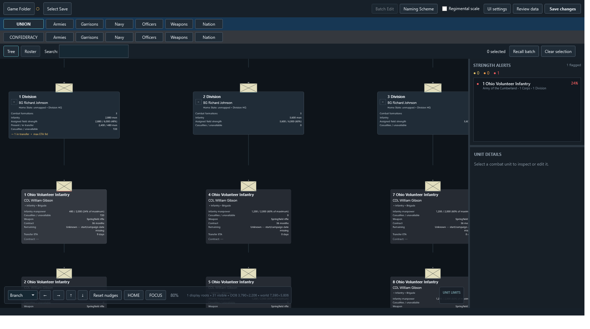
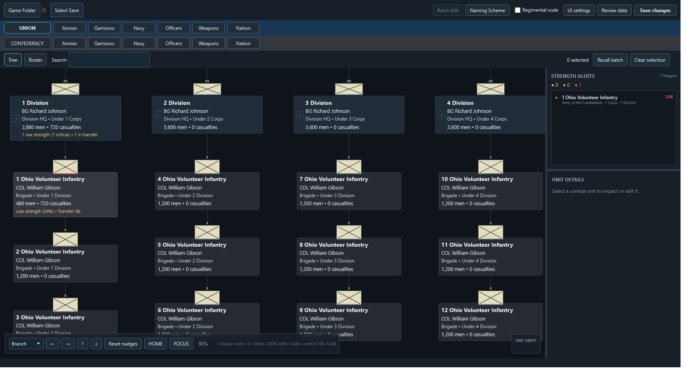
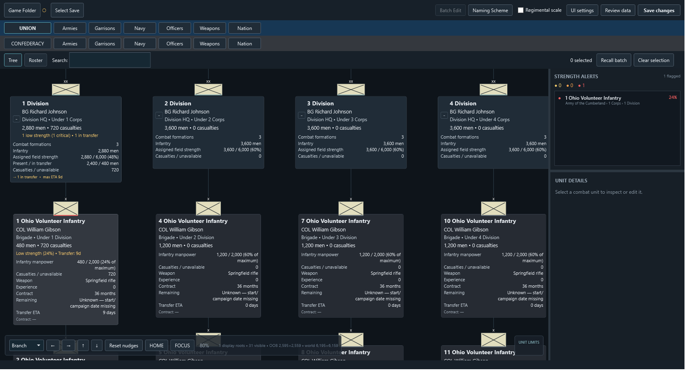

# Tree view: 0.8.11 validation

Validated on Windows x64, October 6, 2026. All evidence uses synthetic formations, with isolated preferences and no game files.

## Outcome

The same six-corps, six-division, eighteen-unit fixture was rendered by the original 0.8.10 source and by 0.8.11. Both use a 1700×950 window, a 1349×719 Tree viewport, 80% zoom, and their version's default settings, positioned at the first division. One unit has casualties and a transfer, so compact command alerts can be inspected.

| Measurement | 0.8.10 | 0.8.11 |
| --- | ---: | ---: |
| Horizontal branch pitch, world pixels | 664 | 438.5 |
| Complete combat columns in the viewport | 2 | 4 |
| Combat commander text at 80%, effective pixels | 9.52 | 12.51 |
| Compact strength text at 80%, effective pixels | Hidden below old detail threshold | 12.51 |

Branch pitch is 34% smaller while commander text is 31% larger. Compact mode now retains names, ranked commanders, immediate parent commands, assigned manpower, casualties, and meaningful alerts. At 80%, 0.8.10 displays its detailed mode; 0.8.11 defaults to compact mode until 95%. Below either version's threshold, the old cards retain invisible detail space while the new ones collapse it. Distant overview zoom still shrinks text; this is not a claim of readability at every zoom.

Before, 0.8.10:



After, 0.8.11:



At the same 80% zoom with the detail threshold deliberately set to 70%, supplemental content expands and rows move apart:



## Implementation and checks

Horizontal contours now reserve each card's width and half its configured edge gutter. Mixed HQ/combat boundaries combine the two half-gutters. Root blocks use their actual outer edges. Vertical layout still clears measured content and floating counters; stack and tier controls have no hidden fixed minimum. Base gutters are additive, and the UI labels and user guide explain their effect.

The configured detail threshold is the only mode switch. WPF measures the active content, rather than fading rows while retaining their space. NATO counters have a consistent configured footprint at both detail levels. Reflow preserves the nearest card's screen position, including the later measurement pass for generated metric rows. Nudge remains a delta applied after automatic layout.

| Check | Result |
| --- | --- |
| Release solution build | Passed; zero warnings/errors |
| Synthetic service suite | 151 passed |
| Existing WPF suite | 569 passed |
| Focused Tree WPF suite | 255 passed |
| Extracted 0.8.11 portable package | Passed; bundled .NET 8.0.30 |

Focused checks compare actual rendered card bounds, not only layout estimates. Coverage includes broad/deep hierarchies, multiple roots, mixed HQ/combat sizes, long names, default/zero/custom gaps, exact gap deltas, 1150/1700 window widths, configured threshold boundaries, text/card scaling, viewport anchoring, Nudge through reflow and hierarchy edit undo/redo, metadata persistence, and UI settings save/reload. Service checks verify that shared leaves do not duplicate compact totals or alerts, and that gun totals remain distinct from manpower. The existing WPF suite also exercises maximum text/counter/card scales.

Run the focused checks and regenerate current screenshots with:

```powershell
$env:AIDE_DE_CAMP_DATA = Join-Path $PWD 'artifacts/test-preferences'
dotnet run --project tests/UiVerification -c Release -- --tree-checks artifacts/tree-after
```

Use `--tree-evidence` instead for capture without assertions. The baseline was captured from commit `406f50e` using the same synthetic setup and capture routine, without the new assertions.

## Boundaries

Saved custom settings remain unchanged; reset the card, spacing, and zoom sections to adopt the defaults. Shared rows and subtree clearance can require more space than one local gap. Zero gaps permit touching edges; positive gutters make connectors clearer. Intentional Nudge offsets can overlap cards and are not automatically corrected. HQ experience remains unmapped. These UI tests do not substitute for campaign acceptance or a clean-Windows compatibility matrix.
